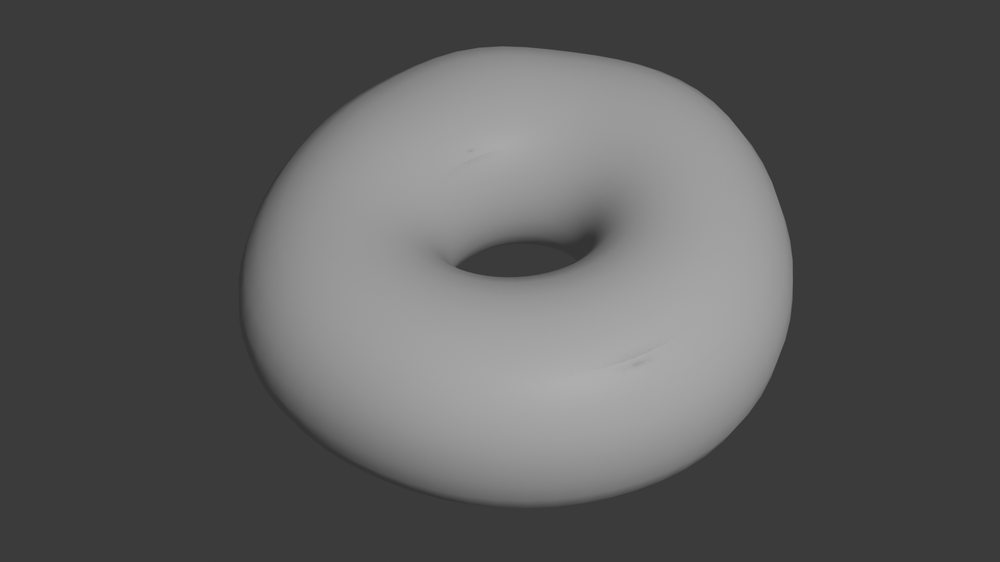
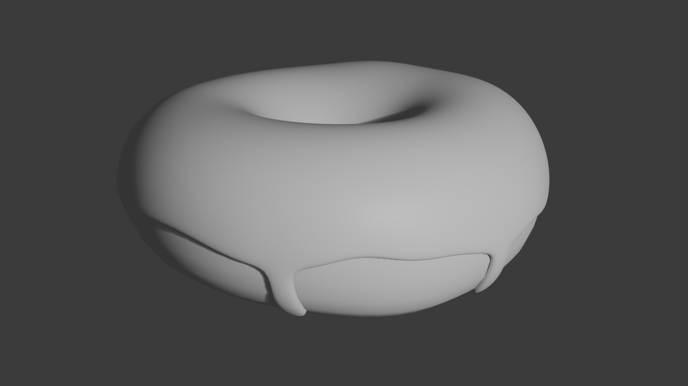
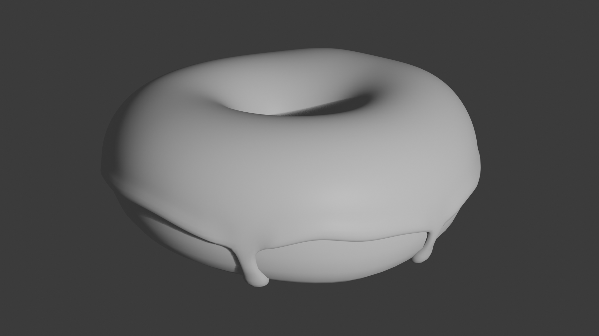

# blender-donut-tutorial

I am following a video guide [Blender Tutorial for Complete Beginners](https://www.youtube.com/watch?v=B0J27sf9N1Y) by Blender Guru on youtube.

Looks like the video is broken into multiple parts, so I will track my progress here as I go.

## Episode 1
[Youtube Link](https://www.youtube.com/watch?v=B0J27sf9N1Y)

This video really just goes over the basics of Blender, and how to navigate, we ended up making a monkey with a hat, I forgot to take a screen shot, so let's just move on to episode 2.

## Episode 2
[Youtube Link](https://www.youtube.com/watch?v=tBpnKTAc5Eo)

In this video, we start making the basic shape of the donut, and adding some deformity. We learned about things like:

  1. Shade smooth vs Shade flat, and when to use one or the other.
  1. Modifiers, and how to increase the resolution of a mesh with Subdivision modifier.
  1. Edit mode for meshes, as well as proportional editing to speed up the process of sculpting our mesh.

Here is a snapshot of my progress.

## Episode 3
[Youtube Link](https://www.youtube.com/watch?v=AqJx5TJyhes&list=PLjEaoINr3zgEPv5y--4MKpciLaoQYZB1Z&index=3)

This episode really picked up speed, we are getting into setting up the icing on the donut. We ended up duplicating our first mesh, and deleting the bottom half of the vertices to come up with the icing mesh. We then used some modifiers to add some thickness too it, add some more geometry to it, so that we can modify it nicely. We also made use of extrusion to creat some driplets of icing going down the side.

Progress pic.

## Episode 4
[Youtube Link](https://www.youtube.com/watch?v=--GVNZnSROc)

We started this episode off with a technical check, to ensure that the mesh was in good shape before we proceeded. It is somtimes super valuable to do these types of checks before moving on as the problems can multiply as we progress.

In this episode we start to get familiar with sculpting. Things like inflate tool, smooth tool, masking and mask filters to have the icing appear more fluid, more realistic.

Progress pic.
