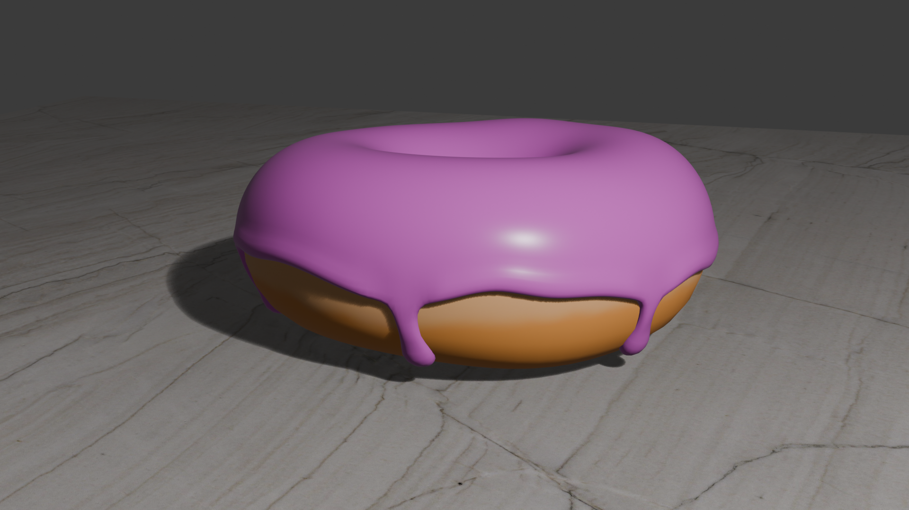
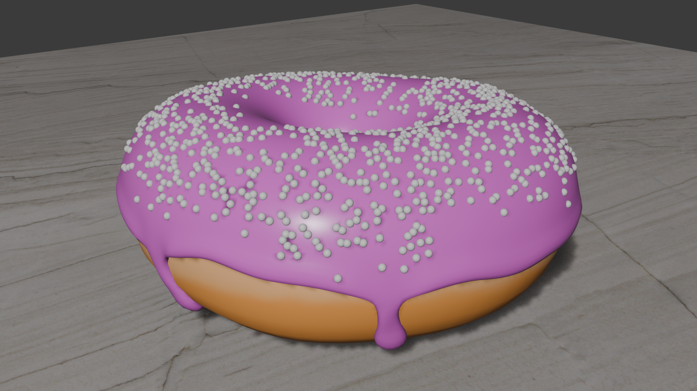
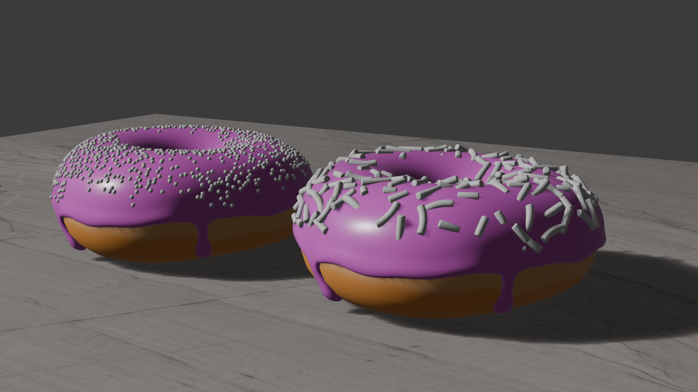
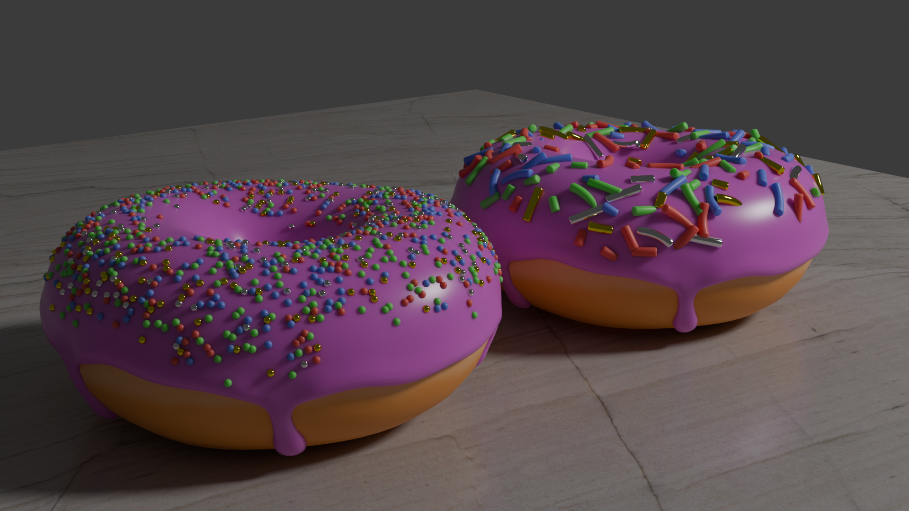
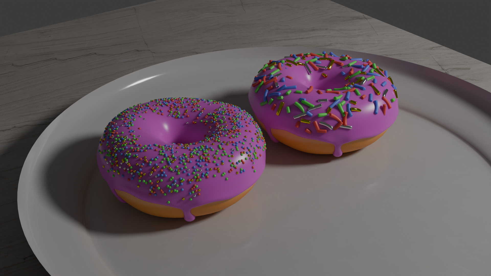
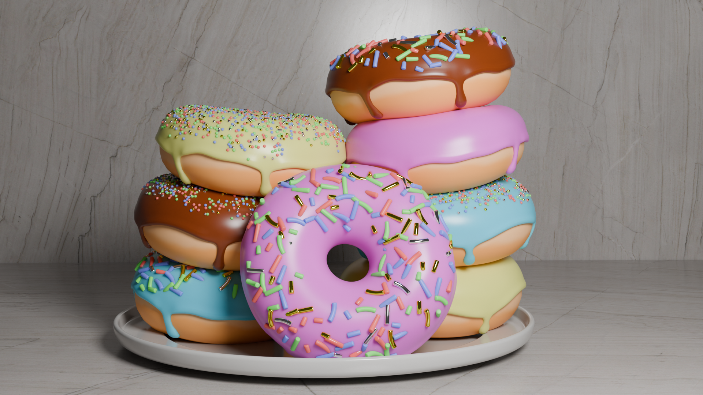
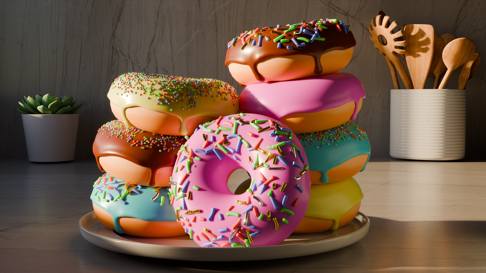

# blender-donut-tutorial

I am following a video guide [Blender Tutorial for Complete Beginners](https://www.youtube.com/watch?v=B0J27sf9N1Y) by Blender Guru on youtube.

Looks like the video is broken into multiple parts, so I will track my progress here as I go.

## Episode 1
[Youtube Link](https://www.youtube.com/watch?v=B0J27sf9N1Y)

This video really just goes over the basics of Blender, and how to navigate, we ended up making a monkey with a hat, I forgot to take a screen shot, so let's just move on to episode 2.

## Episode 2
[Youtube Link](https://www.youtube.com/watch?v=tBpnKTAc5Eo)

In this video, we start making the basic shape of the donut, and adding some deformity. We learned about things like:

  1. Shade smooth vs Shade flat, and when to use one or the other.
  1. Modifiers, and how to increase the resolution of a mesh with Subdivision modifier.
  1. Edit mode for meshes, as well as proportional editing to speed up the process of sculpting our mesh.

Here is a snapshot of my progress.

## Episode 3
[Youtube Link](https://www.youtube.com/watch?v=AqJx5TJyhes&list=PLjEaoINr3zgEPv5y--4MKpciLaoQYZB1Z&index=3)

This episode really picked up speed, we are getting into setting up the icing on the donut. We ended up duplicating our first mesh, and deleting the bottom half of the vertices to come up with the icing mesh. We then used some modifiers to add some thickness too it, add some more geometry to it, so that we can modify it nicely. We also made use of extrusion to creat some driplets of icing going down the side.

Progress pic.

## Episode 4
[Youtube Link](https://www.youtube.com/watch?v=--GVNZnSROc)

We started this episode off with a technical check, to ensure that the mesh was in good shape before we proceeded. It is somtimes super valuable to do these types of checks before moving on as the problems can multiply as we progress.

In this episode we start to get familiar with sculpting. Things like inflate tool, smooth tool, masking and mask filters to have the icing appear more fluid, more realistic.

Progress pic.

## Episode 5
[Youtube Link](https://www.youtube.com/watch?v=fsLO1F5x7yM)

In this episode we got into shading. Doing things like colors for our donuts. As well as setting up a granite couter top on a plane. I also learned about Blender Guru's website [Poliigon](https://www.poliigon.com/). Looks like he has lots of cool free (and paid) assets that I can use for my modeling. The scene is really starting to come together with color!

Progress pic.

## Episode 6
[Youtube Link](https://www.youtube.com/watch?v=TLrA6eJOfqk&list=PLjEaoINr3zgEPv5y--4MKpciLaoQYZB1Z&index=7)

In this episode, we explored geometry nodes! This seems like a really cool feature which allows us to combing different modifiers a d functions in a node like editor, to create some really cool effects. It allowed us to spread a bunch of sprinkles around the top of our donut. We made use of weight painting to control the density of the sprinkles.

**Important** We checked the size of our model was accurate at this point, as it can affect things later if our model sizes are not correct (like camera Field of View), so we are better off using accurate sizes from the start. Apparently there is a feature to use English units (like feet).

Oooh, look at that donut really coming together.

## Episode 7
[Youtube Link](https://www.youtube.com/watch?v=EWTOy5-e4Ns&list=PLjEaoINr3zgEPv5y--4MKpciLaoQYZB1Z&index=7)

In this episode we did some further exploration of geometry nodes. We made some more complex sprinkles (the long sprinkles) and we learned how to do things like randomly select options, randomly rotate them, etc. We even did a bit more edit mode on meshes to come up with the different shapes and sizes of sprinkles.

Those sprinkles are looking mighty fine!

## Episode 8
[Youtube Link](https://www.youtube.com/watch?v=D2rZljDYGdM&list=PLjEaoINr3zgEPv5y--4MKpciLaoQYZB1Z&index=8)

In this episode we dove into materials a bit more. We modified the colors of the sprinkles in the shading window. This also uses a node like editor to add/connect/modify different types of nodes to generate the desired material output. We did things like modify the colors, make things look metallic, and even setup sub-surface scattering to give the materials a more food-like feel.

We also took a look at how the renderer works. I switched to cycles, which is a higher fidelity renderer, it takes longer than the default EEVEE, but makes for some really high-quality, realisting looking renders.

Look at that subsurface scattering, now we are getting somewhere!

There was a small homework assignment to try and create a plate on our own, I think mine came out pretty good!

## Episode 9
[Youtube Link](https://www.youtube.com/watch?v=iv9p3x85Ty0&list=PLjEaoINr3zgEPv5y--4MKpciLaoQYZB1Z&index=9)

In this episode, we worked on the layout of the scene. I ended up following Andrew's method to make the plate, it came out pretty much the same, maybe a little bit better, it was nice practice still. We also ended up placing a few more donuts, changed the color and arrangement of icing. We also adjusted the camera, and setup a backdrop. The scene is really coming together at this point!

Wow look at all those donuts!

## Episode 10
[Youtube Link](https://www.youtube.com/watch?v=KO29y5eW61g&list=PLjEaoINr3zgEPv5y--4MKpciLaoQYZB1Z&index=10)

In this episode we learned about lighting in Blender. I created a box to surround my scene, as well as switched to a skybox lighting, which gives us a virtual sun, and ambient sky lighting. We essentially simulated a kitchen in a house with a window. We also added a few items to the background to give some more variety and depth to the scene. The renders are starting to take a bit longer at this point...

What a nice warm sunlight.

## Episode 11
[Youtube Link](https://www.youtube.com/watch?v=nxrEV-OUTEg&list=PLjEaoINr3zgEPv5y--4MKpciLaoQYZB1Z&index=11)

In this episode, we learned about compositing. This is a way to modify our renders after they have been generated, a type of post processing. We ended up adding some lens glare to the image, so that the metallic sprinkles have a little bit of a glare.

Some tips, don't go overboard with the effects, subtleness is your friend. Also the view sample will not work until you have at least one render done (mash that F12 button!) You can also view the postprocessing on your 3D workspace by enabling it in the dropdown.

Now our scene is looking ever more realistic!
